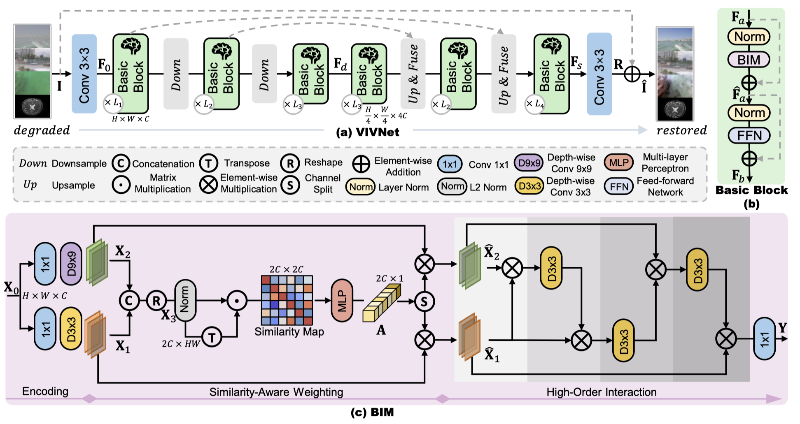

# VIVNet for CVPR 2026 LoViF Challenge

This repository contains the official implementation used for the **CVPR 2026 LoViF Challenge on Real-World All-in-One Image Restoration**.

Our solution is based on **VIVNet**, a biologically inspired image restoration framework designed for efficient and universal image restoration.

VIVNet has been **accepted at T-PAMI**.

---

## Method Overview

Our solution is based on VIVNet, a unified and efficient image restoration framework designed for handling diverse degradation scenarios. The network adopts a U-shaped architecture to extract hierarchical features while maintaining computational efficiency. Within each block, a brain-inspired module models key perceptual mechanisms of the human visual system. Specifically, the encoding stage captures multi-scale visual cues using depth-wise convolutions with different receptive fields. A similarity-aware weighting mechanism then emphasizes informative features through cosine-similarity-based adaptive weighting. Finally, high-order interactions are modeled via iterative element-wise multiplications combined with lightweight convolutions. This design enables strong representation capacity while preserving high computational efficiency for real-world restoration tasks.

More details can be found in the VIVNet paper:

**VIVNet Paper:**  
[Paper link](https://ieeexplore.ieee.org/abstract/document/11419859)

---

## VIVNet Pipeline

Below is the pipeline of the proposed **VIVNet framework**.

<p align="center">

</p>

---

## Performance on LoViF Test Server

Our method achieves strong performance on the **LoViF Challenge evaluation server**.

| Method | Score ↑ | PSNR ↑ | SSIM ↑ | LPIPS ↓ |
|------|------|------|------|------|
| VIVNet (ours) | 35.05 | 24.93 | 0.79 | 0.35 |

---

## Qualitative Results

Example restoration results on the LoViF dataset.

<p align="center">

</p>

---

## Dataset Structure

The dataset is organized as follows:

<details>
<summary>Dataset directory layout</summary>
<pre>
Dataset
├── Train
│ ├── Blur
│ │ ├── GT
│ │ └── LQ
│ │
│ ├── Lowlight
│ │ ├── GT
│ │ └── LQ
│ │
│ ├── Rain
│ │ ├── GT
│ │ └── LQ
│ │
│ ├── Haze
│ │ ├── GT
│ │ └── LQ
│ │
│ └── Snow
│ ├── GT
│ └── LQ
│
└── Test
├── GT
└── LQ
</pre>
**Note**

Since our model is **supervised-based**, but the LoViF challenge does not provide ground truth for the test set, we simply **copy the LQ images into the GT folder** for compatibility during inference.

</details>

## Training

To train the model:
```
python train_eval.py --num_gpus 1 --batch_size 16
```

## Evaluation

Download the LIEDNet pretrained models and the qulitative results from:
| Pretrained Checkpoint | Qulitative Results |
| :-: | :-: |
| [Google Drive](https://drive.google.com/file/d/1E-cawtOPai6KTTdyJ5SLEqblCl3Uuc7W/view?usp=sharing) | [Google Drive](https://drive.google.com/file/d/10Y3u4DUZU3GIAQCsjxuivUYj89GQmNIT/view?usp=sharing) |

To run evaluation on the test set, please save the pretrained checkpoint in the `./checkpoints` folder and then run:
```
python test.py --ckpt_name ./checkpoints/vivnet_lovif.ckpt --output_path $PATH_TO_SAVE_DATA$
```
The restored images will be saved in the output directory and can be submitted to the LoViF evaluation server.

---


## Citation

If you find our work useful, please consider citing:
```
@article{cui2026visual_vivnet,
  title={Visual-in-Visual: A Unified and Efficient Baseline for Image Restoration},
  author={Cui, Yuning and Ren, Wenqi and Shi, Boxin and Knoll, Alois},
  journal={IEEE Transactions on Pattern Analysis and Machine Intelligence},
  year={2026},
  publisher={IEEE}
}
```
---

## License

This project is released under the **Apache License 2.0**.
