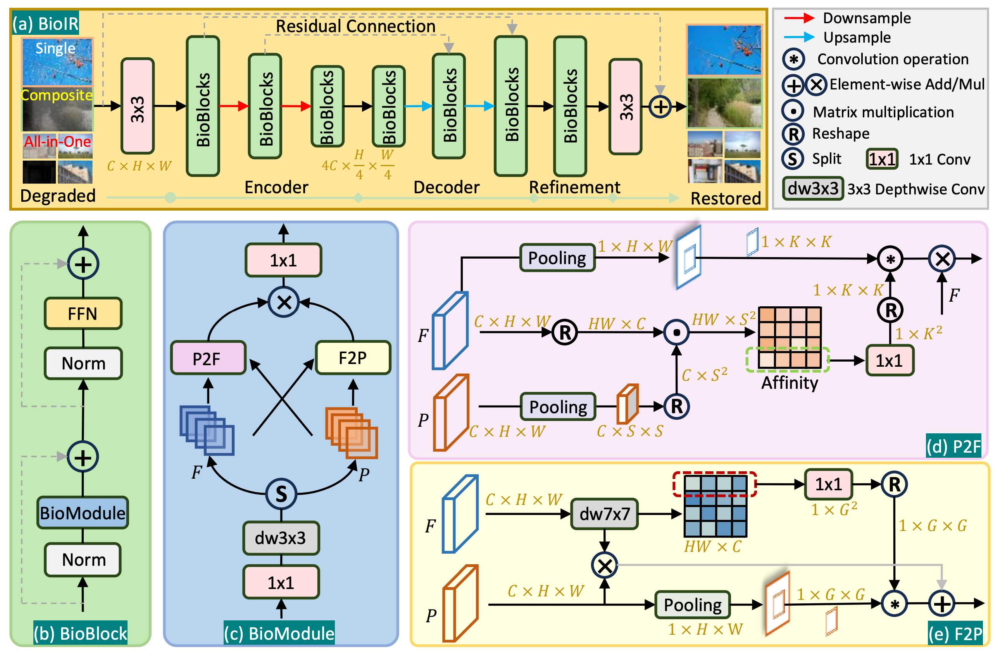
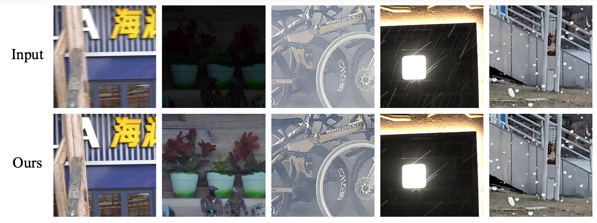

# BioIR for CVPR 2026 LoViF Challenge

This repository contains the official implementation used for the **CVPR 2026 LoViF Challenge on Real-World All-in-One Image Restoration**.

Our solution is based on **BioIR**, a biologically inspired image restoration framework designed for efficient and universal image restoration.

BioIR has been **accepted at NeurIPS 2025**.

---

## Method Overview

Our challenge submission adopts **BioIR**, which models the interaction between **peripheral and foveal visual pathways** inspired by the human visual system.

The framework introduces two bio-inspired modules:

- **Peripheral-to-Foveal (P2F):** delivers large-field contextual information to local regions.
- **Foveal-to-Peripheral (F2P):** propagates fine-grained spatial details via dynamic integration.

This interaction enables effective restoration under multiple degradations.

More details can be found in the BioIR paper:

**BioIR Paper:**  
https://github.com/c-yn/BioIR

---

## BioIR Pipeline

Below is the pipeline of the proposed **BioIR framework**.

<p align="center">

</p>

---

## Performance on LoViF Test Server

Our method achieves strong performance on the **LoViF Challenge evaluation server**.

| Method | PSNR ↑ | SSIM ↑ | LPIPS ↓ |
|------|------|------|------|
| BioIR (ours) | XX.XX | X.XXX | X.XXX |

---

## Qualitative Results

Example restoration results on the LoViF dataset.

<p align="center">

</p>

---

## Dataset Structure

The dataset is organized as follows:

<details>
<summary>Dataset directory layout</summary>
<pre>
Dataset
├── Train
│ ├── Blur
│ │ ├── GT
│ │ └── LQ
│ │
│ ├── Lowlight
│ │ ├── GT
│ │ └── LQ
│ │
│ ├── Rain
│ │ ├── GT
│ │ └── LQ
│ │
│ ├── Haze
│ │ ├── GT
│ │ └── LQ
│ │
│ └── Snow
│ ├── GT
│ └── LQ
│
└── Test
├── GT
└── LQ
</pre>
**Note**

Since our model is **supervised-based**, but the LoViF challenge does not provide ground truth for the test set, we simply **copy the LQ images into the GT folder** for compatibility during inference.

</details>

## Training

To train the model:
```
python train_eval.py --num_gpus 1 --batch_size 16
```

## Evaluation

To run evaluation on the test set:
```
python test.py
```
The restored images will be saved in the output directory and can be submitted to the LoViF evaluation server.

---

## Citation
```
If you find our work useful, please consider citing:
@inproceedings{cuibio,
title={Bio-Inspired Image Restoration},
author={Cui, Yuning and Ren, Wenqi and Knoll, Alois},
booktitle={The Thirty-ninth Annual Conference on Neural Information Processing Systems}
}
```
---

## License

This project is released under the **Apache License 2.0**.
